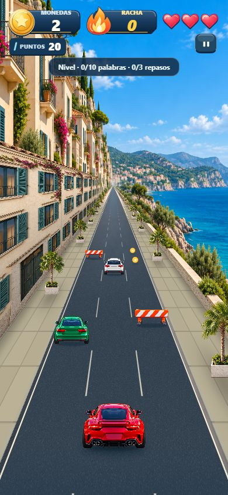
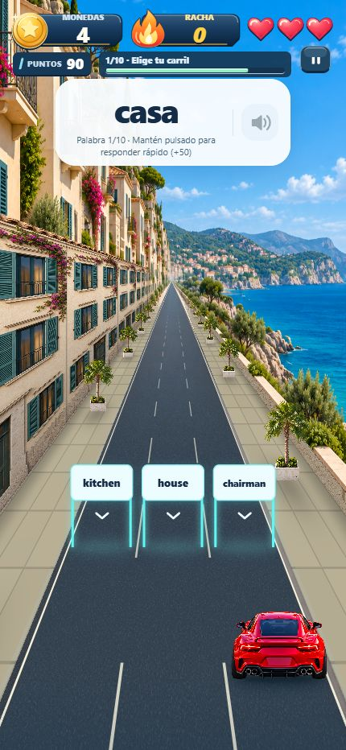

# Costa mediterránea — primera entrega de mapas

Implementado en `codex/map-themes-coast`. Se completa únicamente la costa antes de continuar con montaña, desierto, atardecer y nieve, siguiendo `maps-agent-prompt.md`.

## Arte y registro

Generación con la herramienta integrada `image_gen`. No se usó una API externa, ni se modificaron los vehículos existentes. Tres PNG originales de 1024 × 1536 en `assets/game/maps/coast/`: `backdrop.png`, `walls.png` y `roadside.png`.

Referencias: `background_city_v3.png` para cámara/composición; `facades_city.png` para el atlas ortográfico; `tree_planter.png` para el sprite y su iluminación. Los prompts íntegros están al final de este documento.

La placa contiene casas crema con contraventanas verdes a la izquierda y un murete con mar/cabo a la derecha. El horizonte permanece fijo; fachadas, pavimento y palmeras avanzan con la distancia existente del motor. Los objetos del juego, la velocidad, las preguntas y sus colisiones no dependen del mapa.

| Parámetro | Valor final |
| --- | --- |
| Punto de fuga medido | (514.328, 669.015) px; 50.2274% / 43.5557% |
| Pendiente izquierda | −0.533690 px/px |
| Pendiente derecha | +0.494776 px/px |
| Pendiente registrada | media 0.514233 px/px |
| Escala base de ancho | 1.22; cobertura adicional calculada según pantalla |
| Atmósfera radial | 0.018, color `#ADBCBA` |
| Bruma del asfalto | 0.08; decae hacia el jugador |
| Pared izquierda | distancia 2.75 carriles, altura 4.8, módulos de 3 |
| Murete derecho | distancia 2.75, altura 0.38, módulos de 3 |
| Pavimento | piedra caliza, baldosas 0.40 × 0.40, juntas sutiles |
| Palmeras | distancia lateral 2.12, altura 1.55, separación 2.4, 14 por lado |
| Base del sprite | 1503 / 1536 |

Medición reproducible: `node scripts/measure-coast.cjs`. Se localiza la transición asfalto/piedra y se ajustan dos rectas sobre 12 alturas entre y800 e y1450. Se excluyen y900/y1300 por falsos positivos de piedra/sombra. La imagen tiene una pequeña asimetría; se usa la pendiente media y el fundido existente del borde para la unión con el plano jugable. Datos originales y ajuste: [coast-measurements.json](coast-measurements.json).

El sprite tiene **54.729% de píxeles con alfa exactamente 0**, alfa máximo 254 y caja visible, con alfa >32, `[78, 20, 969, 1503]` (extremos derechos/inferiores exclusivos). El RGB invisible del PNG no se usa como fondo. La base medida se alinea con el suelo; las hojas quedan fuera de los tres carriles incluso al acercarse.

## Arquitectura

- `config/maps.ts`: parámetros/registro de temas; `city` conserva la configuración previa. `MapId` incluye los seis destinos; solo `city` y `coast` tienen assets terminados.
- `data/mapTheme.ts`: resuelve nivel → unidad → tema. Repaso, niveles desconocidos y temas pendientes resuelven explícitamente a ciudad. No se han añadido ni renumerado niveles.
- `world/mapImages.ts`: referencias estáticas de Metro. `GameWorld` decodifica únicamente las tres imágenes del tema activo y el asfalto compartido.
- `CityBackdrop`, `ScenerySurfaces`, `Road` y `RoadsideTrees` reciben el tema. No hay capas adicionales a pantalla completa, desenfoques animados, dependencias nuevas ni cambios de versiones.
- `geometry/backdrop.ts`: registro del punto de fuga/bordillos. La proyección del motor no se modifica.

## Capturas web

La ruta `/map-preview?map=coast&pose=traffic&clean=1` solo está habilitada en desarrollo; no escribe progreso ni reproduce audio. Usa el renderizador, HUD y portales reales con un estado determinista del motor. `pose=question` muestra los tres portales y `pose=right` coloca el carro en el carril derecho. Sin `clean=1`, el botón inferior permite animar/detener un tramo de tráfico para inspección visual.

| Tamaño | Tráfico | Pregunta | Carril derecho |
| --- | --- | --- | --- |
| 320 × 568 | [Captura](previews/coast-320-traffic.png) | [Captura](previews/coast-320-question.png) | [Captura](previews/coast-320-right.png) |
| 390 × 844 | [Captura](previews/coast-390-traffic.png) | [Captura](previews/coast-390-question.png) | [Captura](previews/coast-390-right.png) |
| 430 × 932 | [Captura](previews/coast-430-traffic.png) | [Captura](previews/coast-430-question.png) | [Captura](previews/coast-430-right.png) |





Se revisaron alineación de bordillos, repetición de fachadas, apoyo de palmeras, contraste del tráfico y portales, y estabilidad del horizonte al avanzar/detener. Los dos fotogramas `coast-motion-a.png` / `coast-motion-b.png` documentan el avance. No se registraron errores de consola en la sesión limpia de validación. Durante el desarrollo hubo un error transitorio de recarga en caliente al cambiar la firma del shader; una carga nueva con los uniforms completos quedó sin errores.

En 320 px persisten las limitaciones del HUD anterior (abreviación del rótulo de monedas y texto auxiliar apretado en la tarjeta). No se modificó el HUD, tal como exige el alcance del prompt.

## Comparación de ciudad

Se guardaron nueve capturas `city-before-*` antes de parametrizar el renderizador y nueve `city-after-*` con los mismos estados, tamaños y distancia. La composición, assets, horizonte, colores configurados y geometría se conservan. `node scripts/compare-city-captures.cjs` compara RGBA y guarda [city-comparison.json](previews/city-comparison.json).

La comparación no es idéntica bit a bit: pasar constantes del shader a uniforms produce pequeñas diferencias de precisión en el pavimento. Diferencia media máxima por canal: **0.034 sobre 255**; menos del **0.54%** de los píxeles difieren más de dos unidades por canal. No se cambió la dirección artística ni el encuadre de la ciudad.

## Validación

- TypeScript general y compilación de geometría: correctos.
- ESLint sobre `src`: sin errores ni advertencias.
- Suite `tests/city/*.test.cjs`: **119 pasan, 3 fallan**; antes eran 113 correctas y las mismas 3 fallidas. Se añadieron seis pruebas de registro, assets, resolución de niveles, proyección y transparencia.
- Fallos previos en `journey.test.cjs`: numeración esperada del catálogo antiguo; extensión del catálogo; cursor final. El catálogo importado de 3000 palabras ya invalidaba esas expectativas. No se ocultaron ni se alteraron esas pruebas.
- Exportación de producción web, iOS y Android: correcta. Hermes requirió ejecutar el compilador instalado fuera del entorno restringido; no se instalaron herramientas nuevas.
- Pendiente: comprobación visual y de memoria/FPS en iPhone/Android físicos. No se ha medido rendimiento en dispositivo y la exportación no sustituye esa prueba.

## Prompts finales


### backdrop

```text
Use case: stylized-concept. Asset type: environment background plate for an existing premium 2.5D mobile driving game. Portrait 1024 x 1536, opaque.
Input image: the city plate is the master reference for CAMERA HEIGHT, FRAMING, ONE-POINT PERSPECTIVE, RENDER QUALITY and polish. Do NOT copy its architecture or palette.
Scene: a Mediterranean coastal drive. On the LEFT tightly spaced cream and pale sandstone stucco townhouses with dark desaturated teal shutters, balconies, very restrained bougainvillea high on the facades and a low rocky hillside. On the RIGHT a low limestone parapet beside an open blue-turquoise sea with a layered olive-green headland in the far distance. The road is absolutely straight. Do not mirror buildings onto the sea side. Refined premium 3D architectural render, readable medium-value surfaces, warm midday sunlight from upper left.
Geometry critical: perfectly centered one-point perspective, no tilt, no curve. Elevated camera matching reference. Vanishing point about pixel (508,677). Asphalt edges are straight rays toward (104,1536) and (912,1536); at y1000 road spans x356..x660, y1300 x215..x801. A narrow limestone sidewalk begins immediately outside each ray, no extra shoulders or medians. Right parapet is LOW so the sea remains clearly visible. The road leads straight toward the distant headland.
Road: uninterrupted plain dark slate asphalt similar to #394450, fine low contrast grain, no markings or curb paint, no large shadows across it. Calm low-detail bottom quarter.
Depth from layered occlusion, only tiny distant haze at the vanishing point, no horizontal fog stripe, bloom or glare.
Readability: upper quarter a rich medium Mediterranean blue sky, not pale/white. Houses softly shaded cream, never pure white. Horizon muted blue-green, avoid brilliant white and bright cyan in the portal area. No saturated red/orange in lower half. Keep the roadway dark, the red player car added later must be the dominant accent.
NO cars, vehicles, people, animals, text, signs, billboards, logos, traffic lights, lane markings, UI or watermark. Environment plate only.
```


### walls

```text
Use case: stylized-concept. Asset type: opaque side-wall texture atlas for a premium 2.5D driving game, portrait 1024 x 1536.
Input reference: existing city facade atlas establishes perfectly FLAT FRONTAL orthographic projection, finish and render detail, not architecture or palette.
Two separate texture panels side by side, each exactly 512 px wide. LEFT HALF: one seamlessly repeating Mediterranean townhouse facade, three floors, warm shaded cream stucco, muted teal shutters and dark inset windows, modest stone ground-floor entrance, restrained bougainvillea in the upper portion only, uniform lighting from upper left. No bright white and no red flowers in lower half. Bottom edge is street-level foundation, top edge facade roofline. Keep both vertical panel edges clean uniform stucco so horizontal repeats meet naturally.
RIGHT HALF: seamless uniform pale warm-grey limestone masonry material for a LOW sea parapet. Entire half filled with big finely textured limestone blocks, mortar subtle, no architecture, no windows. Deliberately only TWO broad horizontal courses, as this half will be compressed to a low wall in engine. Top edge a continuous grey limestone cap, base bottom. Both vertical edges match horizontally.
Both elevations perfectly front-facing, NO perspective, NO vanishing lines, NO sky, NO ground plane, no cast shadows from outside objects, no strong vignette, no divider frame or gap between halves. No text, signs, logos, people, vehicles, or watermark.
```


### roadside

```text
Use case: stylized-concept. Production game sprite, ONE isolated compact Mediterranean fan palm in a pale weathered limestone square planter, for a forward-driving mobile game.
Input image: reference tree-in-planter establishes premium polished 3D render, slightly elevated frontal camera, upright verticals, sunlight from upper left, and base registration. Replace the tree species with a slender palm; preserve this camera and polished render style. No glowing halo.
Genuinely transparent RGBA alpha background. No checkerboard painted into image, no background color. Portrait 1024 x 1536. Entire object visible centered; trunk vertical. Palm foliage moderately narrow, maximum 70% canvas width, slender trunk, planter maximum 28% canvas width. At least 45% fully transparent pixels overall. Base at bottom center with about 3% transparent bottom margin; highest frond leaves 3% margin at top. Object fills about 94% canvas height.
Palm fronds restrained deep olive green, warm neutral trunk, subtly shaded cream limestone planter with small dark earth surface. Not luminous, no saturated reds/oranges. Viewed slightly from above as the reference, base plane visible.
No ground patch outside planter, no cast ground shadow, no sun glow or haze around foliage, no text, people, cars or additional objects. One object, no collage.
```
